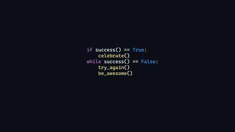

# Curso Grátis de Git e GitHub
Material do **Curso de Git e GitHub**, disponível gratuitamente no canal do *YouTube*.

# Aula Sobre a Linguagem MarkDown
***
Este é um exemplo da aula do curso de __*Git e GitHub*__ e não sobre ~~HTML~~.

## Título 2

### Título 3

## Lista Numerada:

1. Teste
2. Teste2
3. Teste3
999. Teste4
    1. Teste5
    1. Teste6


## Lista Demarcada:

* Teste
* Teste2
* Teste3
    * Teste4
* Teste5

## Lista de Tarefas:

- [x] Criar a página principal
- [x] Criar a página da loja
- [ ] Finalizar a reunião com o cliente
- [ ] Receber pagamento


## Mostrar uma imagem:



## Link:

[Acesse meu GitHub](https://github.com/FrancescoGhisi)

## Tabela:

Nome | Num | Nota
---|---|---
Francesco | 7 | 10


## Referenciar um comando:

Não compreendo `document.getElementById()` no JavaScript.

## Emojis:

:laughing: :vulcan_salute:

## Trecho de código fonte:

```java

package model.entities;

public class PilhaDeCarro {

    private Carro topo;
    private Integer tamanho;

    public PilhaDeCarro() {
        topo = null;
        tamanho = 0;
    }

    public Carro mostraTopo() {
        return topo;
    }

    public Boolean estaVazia() {
        return topo == null;
    }

    public void empilhar(String placa) {
        Carro novo = new Carro(placa);
        if (!estaVazia()) {
            novo.setProximo(topo);
        }
        topo = novo;
        tamanho ++;
    }

    public Carro desempilhar() {
        Carro retornaValor = new Carro(null);
        if (estaVazia()) {
            retornaValor.setPlaca("PILHA ESTÁ VAZIA");
            return retornaValor;
        }
        retornaValor = topo;
        topo = topo.getProximo();
        return retornaValor;
    }

    public Integer getTamanho() {
        return tamanho;
    }
}

```